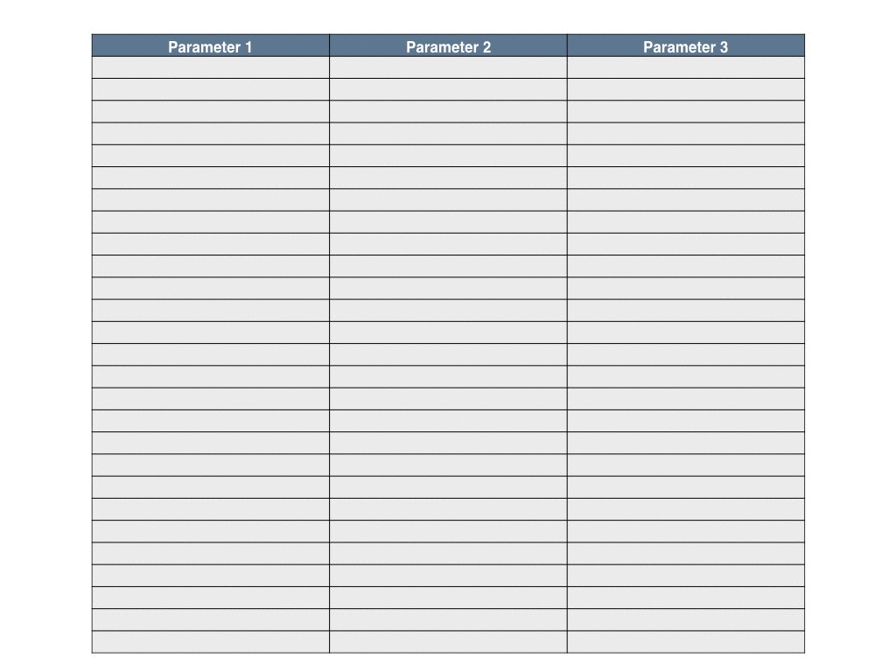

```{r setup, include=FALSE}
knitr::opts_chunk$set(echo = TRUE)
```

# Intro

## Basics

Sensitivity analysis aims to get insight into the effect of input parameter
variations on model output (for details see 
[Wikipedia](https://en.wikipedia.org/wiki/Sensitivity_analysis); 
for an overview see also the 
[paper of Thiele et al.](http://jasss.soc.surrey.ac.uk/17/3/11.html)). 
Latin Hypercube Sampling is an approach to Sensitivity Analysis (see [Wikipedia](https://en.wikipedia.org/wiki/Latin_hypercube_sampling)) 
to sample parameter values in a efficient way by dividing the multi-dimensional
parameter space into strata, which contain the same number of parameter 
combinations. This approach is especially useful, if we have to deal with
a large amount of discrete data and only limited or no knowledge about the 
multivariate distribution of input parameters and dependencies between them. 
One may want to run statistical tests to gain that knowledge. Another 
straightforward approach is to slice the data at hand directly into strata. 
Then, out of each stratum one single parameter point can be chosen randomly to 
perform the next steps of sensitivity analysis.

## Use case

The presented approach is useful, if you have a model to analyze and

- a large amount of discrete data on input parameters, i.e. parameter points,

- insufficient knowledge about distribution and/or dependencies of the 
  multivariate input parameters,

and if you want to sample points in parameter space to perform a sensitivity 
analysis.

# Example

## Data

To give an example we generate a data_frame `original.data` containing four 
dependent parameters `var1`, ..., `var4`.

```{r, message=FALSE}
library(dplyr)

len <- 1e+4
dist1 <- runif(len, min = 1, max = 5) 
dist2 <- rnorm(len, mean = 0, sd = 3)
dist3 <- rnorm(len, mean = 4, sd = 1) 
dist4 <- rlnorm(len, meanlog = 0, sdlog = 0.5)
l <- list("var1" = dist1 * dist3,
          "var2" = dist2,
          "var3" = dist3 * dist2,
          "var4" = dist4 * dist3 + dist2)
original.data <- as_data_frame(l)
```

## Plots

The Shiny app below allows you to choose the number of strata, which will be the
same for all four parameters. The stratification of the first two parameters is
shown in the upper plot, stratification of the third and fourth parameter is
shown in the lower plot.

Double-click inside one of the strata in the upper plot to see which subset of
parameters tree and four belongs to the selected stratum.

```{r tabsets, echo=FALSE}
shinyAppDir("app",
  options = list(
    width = "100%", height = 810
 )
)
```

# Code

In the following R-Code is shown, which performs that stratification efficiently.
The code uses mainly `dyplr` and related packages for data preparation, 
`ggplot2` for plotting and and `shiny` for interactivity.

## Recursive function

The basic idea for the stratification is to proceed parameter-wise:

1. Take the first parameter i.e. the first column of the data_frame passed to
   the function.

2. Slice that parameter into equally sized strata.

3. Recursively call this function for the remaining parameters in each stratum.

The animated gif illustrates this algorithm for three parameters and three 
strata per parameter, i.e. $3^3 = 27$ strata in total:

You can see that first parameter 1 is stratified then the first part of 
parameter 2, then the first part of parameter 3, than parameter 2 again and so 
on. The code for this function reads as follows.

```{r, message=FALSE}
rm(list = ls())

library(dplyr)
library(tidyr)
library(tibble)
library(lazyeval)

# Recursive function to calculate strata. 
# Parameters: 
# dta:         data_frame with any number of parameters each
#              column is exspected to represent one parameter  
# numb.strat:  number of strata in each dimension
stratify <- function(dta, numb.strat=4) {
  parameters <- names(dta)                    # get the names of parameters,
  param <- parameters[1]                      # store the name of the first,
 
  n <- dta %>%                                # claculate the number of values 
    summarise(n())                            # (repetitions included),
  n <- n$`n()`                                # calculate the number of 
  s <- floor(n / numb.strat)                  # parameter values per stratum,

  if (!is.integer(n / numb.strat)) {          # ommit randomly all values which
    n <- (s * numb.strat)                     # are too much to fit in the given 
    dta <- dta %>%                            # stratum,
     sample_n(n)
  }

  strata <- dta %>%                           # take the data,
    select_(param) %>%                        # select the first parameter,
    arrange_(param) %>%                       # sort param values,
    slice(c(1, seq.int(from = s,              # extract strata limits,
                       to = n, 
                       by = s)))
  
  results <- data_frame()
  for (i in 1:(numb.strat)) {                 # for each stratum of the first
    lower.bound <- interp(~v >= x,            # parameter calc lower boundary,
                          v = as.name(param), 
                          x = as.double(strata[i, 1]))
    upper.bound <- interp(~v < y,             # and calculate upper boundary,
                          v = as.name(param), 
                          y = as.double(strata[i + 1, 1]))
    not.param <- interp(~-v, v = as.name(param))
    next.strat <- dta %>% 
      filter_(lower.bound) %>%                # filter the stratum which is
      filter_(upper.bound) %>%                # to be stratified next,
      select_(not.param)                      # select the remaining parameters,

    if (length(parameters) > 1) {             # unstratified parameters left?
      next.strat <- stratify(next.strat,      # stratify them
                             numb.strat)
      new.col <- interp(~a, a = as.double(strata[i, 1]))
      next.strat <- next.strat %>%            # combine stratification results
        mutate_(.dots = setNames(list(new.col), param)) 
      results <- bind_rows(results, next.strat) # bind strata of param together
    } else {
      return(slice(strata, -1))               # recursion reached leaf of tree
    }            
  }
  return(results)                             # done. return the stratum
}
```

## Using `stratify()`

`stratify()` stratifies your multivariate input parameters. If the number of
parameters is $n$ and the number of strata per parameter dimension in $k$,
then 'stratify()` returns $k^n$ equally sized strata. I.e. all strata have the 
same probability of being randomly chosen.

### Parameters

The recursive function `stratify()` receives two parameters: 

- `dta`: the data_frame containing the parameters, which are to be stratified and  

- `numb.strat`: the number of strata in each parameter dimension. The returned 
data_frame contains in each column the lower boundary of each stratum.

### Value

As the returned value of the `stratify` is the data frame `results` containing 
the lower limits of each stratum. Note that the parameters are stratified 
consecutively. This means that the stratification of the second parameter 
depends on the stratification of the first parameter, the third on the second 
and so on. The column names (i.e. parameter names) are preserved.

## Performance

Let $n$ be the number of parameters and $k$ the number of strata per parameter. 
Basically `stratify` traverses a tree with $k$ child nodes per node and all paths 
having length $n$. It computes stratification in $O(k^n)$ for a given total 
number of parameter combinations.

Computing time increases strongly for bigger data sets. For example for a
4-dimensional parameter space elapsed computing time is shown in the following
violin plot:

```{r, echo=FALSE}
library(dplyr)
library(ggplot2)

dta <- as_data_frame(read.csv("data/benchmark.csv"))
dta <- dta %>% 
  select(-X) %>% 
  gather(key = "no.use", value = "time", 3:52) %>% 
  select(-no.use) %>% 
  transmute(no.data.points = V1, data.size = V2, time)

ggplot(dta, aes(factor(no.data.points), time)) +
  geom_violin(trim = TRUE, 
              scale = "width", 
              fill = "lightgreen", 
              colour = "darkgreen",
              adjust = 1.5) + 
  coord_flip() +
  scale_y_log10() +
  labs(x = "number of data points",
       y = "log of elapsed time in seconds")
```

The performance of the algorithm could be increased be using parallelization.
However, parallelize recursive functions appears to be a non-trivial task and 
will be subject to another post.

## Shiny app

You can examine and download the code of the example shiny app on
[github](https://github.com/stenzei/stratify). 


# Acknowledgements
I thank Sebastian H. and Marco S. for helpful comments and hints.
